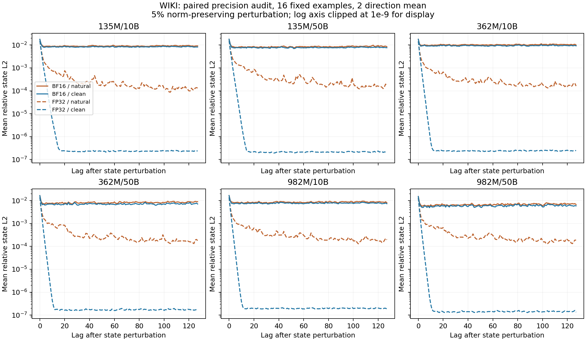
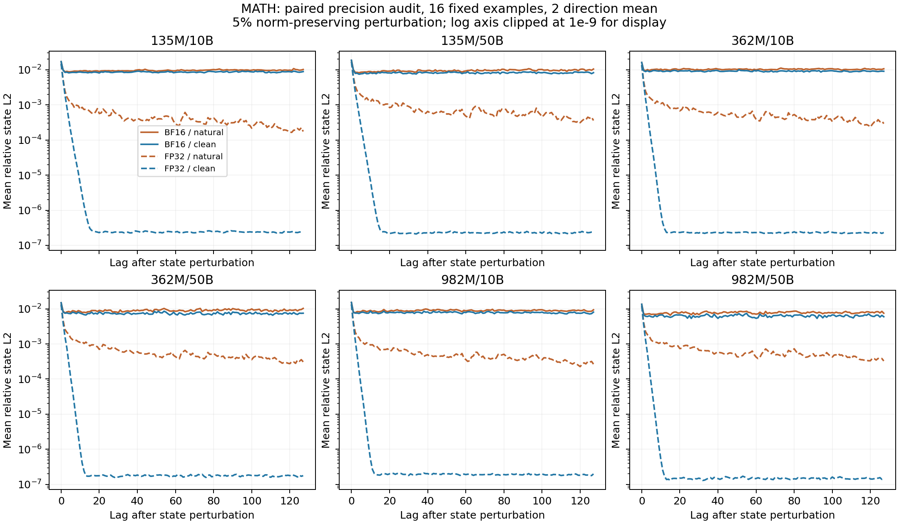

# T²MLR Phase A：状态扰动、恢复与精度对照

本轮完成六个 checkpoint × 两领域的非训练补充测量：零重置、两个固定随机方向的小扰动、自然与 clean-KV 轨迹、state/output impulse AUC、恢复阈值时间。沿用每领域 256 个冻结输入；旧 carry_off 结果见六 checkpoint NLL 报告。没有执行 Jacobi 或其他训练。

## 结论及边界

最需要修正的机制读法是：BF16 小扰动长尾不能直接当作长期记忆。本轮主测量的 12 个组合中，小扰动自然路径 t10 均没有样本达标；但固定 16 样本的同 batch FP32 对照中，自然路径 t10 中位数为 4–9 步，clean-KV 为 2–3 步，自然路径 state AUC 相比 BF16 缩小约 8.8–17.4 倍。这支持显著的数值精度敏感性；不证明残留的全部来源，也不把 FP32 子集当完整任务评测。

零重置后，所有组合的状态 t50 中位数为 1 步；自然路径 t10 为 5–20 步，clean-KV 为 2–3 步。362M/50B 数学的自然 t10 为 20 步，clean 为 2 步，且状态/KL AUC 与远期 NLL 均显示自然路径更强。这个例外在同数据的新测量中保留，但小扰动没有对应的远期平均损失，因此不能概括为普遍的局部慢混合或持续推理。

10B→50B 没有统一的零重置 state AUC 趋势：135M 与 982M 两领域下降，362M 文本不明确、数学上升。共有 Jacobi(16,4) 配置并不足以推出统一恢复尺度；checkpoint 比较不能确定训练 horizon 的因果作用。当前支持短程恢复及 KV 路径相关传播的有限机制描述，不支持“Jacobi 导致短记忆”或“状态长尾就是有益推理”。

两个随机方向不覆盖所有状态子空间，也不是对语义变量的定向干预。迅速恢复不能排除少数持久方向、状态内容被 attention 重建或其他输入分布下的行为；本轮没有测自由解题准确率，也不能外推到未公开的 1.7B retrofit。公开语料还不能保证无预训练重叠。所有区间均为未做多重比较校正的点态区间。

## 固定配方

小扰动在 incoming state 的随机切向方向上加入约 5% 范数的位移，再恢复原范数并转换至执行精度。两个独立方向由文档 ID 与方向序号确定，在样本内平均，不计作两份独立数据。零重置与小扰动都分别保留自然 KV 或每步恢复正常前缀 KV。数学保持完整题目与参考解答 teacher forcing，干预位于解答起点；这不是自由解题评测。

state response 为扰动/正常 post-transition state 的相对 L2；输出 response 为 KL(normal || perturbed)，用 FP32 log-softmax 算全词表分布。AUC 是 lag 1–64 的离散求和，不是这 64 步的均值。恢复指标以 lag 0 的 post-transition response 为基准，要求连续 5 步低于 50% 或 10%；窗口内允许的事件起点为 1–123，未达到则右删失。这里的“半衰时间”是阈值首次持续跨越，不是拟合的指数衰减常数，也不保证后续不反弹。

主实验 BF16、batch 32；2,000 次文章/题目级 bootstrap、点态 95% CI。FP32 对照固定每领域 16 个完整窗口样本，并以相同 batch 8 重跑 BF16；FP32 禁止 TF32。精度子集不并入 n=256 主结果，也不是独立任务确认。

## 样本与主 AUC

| checkpoint / 数据 | AUC n / recovery n | zero 自然 state AUC | zero 自然 KL AUC | small 自然 state AUC | small 自然 KL AUC |
|---|---:|---:|---:|---:|---:|
| 135M/10B / wiki | 256 / 256 | 1.651 [1.579, 1.7299] | 0.36189 [0.28057, 0.46094] | 0.56171 [0.55908, 0.56439] | 0.023342 [0.023025, 0.023642] |
| 135M/10B / math | 230 / 169 | 1.7007 [1.6763, 1.7268] | 0.16769 [0.15879, 0.178] | 0.59612 [0.59283, 0.59952] | 0.02732 [0.026728, 0.027922] |
| 135M/50B / wiki | 256 / 256 | 1.5567 [1.4811, 1.638] | 0.38465 [0.28469, 0.50211] | 0.52613 [0.52328, 0.52918] | 0.032405 [0.031886, 0.032898] |
| 135M/50B / math | 230 / 169 | 1.6065 [1.5395, 1.6865] | 0.20812 [0.1641, 0.26232] | 0.58189 [0.57803, 0.58586] | 0.042958 [0.041573, 0.044398] |
| 362M/10B / wiki | 256 / 256 | 1.8776 [1.7934, 1.9639] | 0.25085 [0.20549, 0.30751] | 0.64505 [0.64148, 0.64897] | 0.020053 [0.019737, 0.020369] |
| 362M/10B / math | 230 / 169 | 1.8969 [1.8569, 1.9373] | 0.16866 [0.15939, 0.17918] | 0.65654 [0.65323, 0.65979] | 0.023473 [0.022947, 0.023975] |
| 362M/50B / wiki | 256 / 256 | 1.8785 [1.7023, 2.0583] | 0.92817 [0.71382, 1.166] | 0.50801 [0.50389, 0.51266] | 0.035174 [0.034449, 0.035914] |
| 362M/50B / math | 230 / 169 | 2.8461 [2.5772, 3.135] | 2.3205 [1.8493, 2.8224] | 0.56267 [0.558, 0.5674] | 0.049773 [0.047911, 0.051699] |
| 982M/10B / wiki | 256 / 256 | 1.5664 [1.4954, 1.64] | 0.21102 [0.17152, 0.25652] | 0.54858 [0.54474, 0.55256] | 0.01998 [0.019661, 0.020279] |
| 982M/10B / math | 230 / 169 | 1.426 [1.3995, 1.4551] | 0.10901 [0.10333, 0.11545] | 0.57163 [0.56789, 0.5754] | 0.024194 [0.023597, 0.024758] |
| 982M/50B / wiki | 256 / 256 | 1.235 [1.1799, 1.2933] | 0.45606 [0.38076, 0.53676] | 0.43321 [0.42841, 0.438] | 0.02997 [0.02922, 0.030692] |
| 982M/50B / math | 230 / 169 | 1.2478 [1.2184, 1.2796] | 0.26477 [0.2428, 0.29275] | 0.49307 [0.48856, 0.49749] | 0.042521 [0.040868, 0.044146] |

小扰动列是两个方向在每个样本内平均后的结果。未列出的单方向、clean-KV、按注入幅度归一化的 AUC、跨训练量配对差，均在机器可读结果中保留。AUC 只纳入完整 65 个 targets；恢复指标只纳入完整 128 个 targets，不能把短解答算成零响应。

## BF16 状态恢复时间

| checkpoint / 数据 | zero 自然 t50 / t10 中位数 | zero clean t50 / t10 | small 自然 t50 / t10 | small clean t50 / t10 |
|---|---:|---:|---:|---:|
| 135M/10B / wiki | 1 / 6 | 1 / 3 | 13 / >123 | 5 / >123 |
| 135M/10B / math | 1 / 5 | 1 / 3 | 37 / >123 | 5 / >123 |
| 135M/50B / wiki | 1 / 7 | 1 / 3 | 6 / >123 | 2 / >123 |
| 135M/50B / math | 1 / 6 | 1 / 3 | 2 / >123 | 2 / >123 |
| 362M/10B / wiki | 1 / 8 | 1 / 3 | >123 / >123 | 114 / >123 |
| 362M/10B / math | 1 / 9 | 1 / 3 | >123 / >123 | >123 / >123 |
| 362M/50B / wiki | 1 / 8 | 1 / 2 | 12 / >123 | 6 / >123 |
| 362M/50B / math | 1 / 20 | 1 / 2 | 87 / >123 | 9 / >123 |
| 982M/10B / wiki | 1 / 9 | 1 / 3 | 41 / >123 | 12 / >123 |
| 982M/10B / math | 1 / 7 | 1 / 2 | >123 / >123 | 24 / >123 |
| 982M/50B / wiki | 1 / 6 | 1 / 2 | 6 / >123 | 2 / >123 |
| 982M/50B / math | 1 / 5 | 1 / 2 | 41 / >123 | 6 / >123 |

`>123` 表示到可观测事件起点上限仍不足一半样本达标，不能给出未删失中位数；不把它替换成 124 步“真实恢复时间”。机器可读结果同时提供事件数、删失数、达标比例及到 124 的受限均值。小扰动恢复时间在每个样本的方向平均响应曲线上计算；单方向结果另存。

## 精度敏感性：固定 16 样本对照

| checkpoint / 数据 | small 自然 state AUC BF16 → FP32 | small clean state AUC BF16 → FP32 | small 自然 t10 BF16 → FP32 | small clean t10 BF16 → FP32 |
|---|---:|---:|---:|---:|
| 135M/10B / wiki | 0.57556 → 0.036639 | 0.53479 → 0.010437 | >123 → 4 | >123 → 3 |
| 135M/10B / math | 0.59997 → 0.042856 | 0.54873 → 0.0087059 | >123 → 4 | >123 → 3 |
| 135M/50B / wiki | 0.53291 → 0.046758 | 0.49314 → 0.010075 | >123 → 6 | >123 → 3 |
| 135M/50B / math | 0.58597 → 0.066418 | 0.52238 → 0.010445 | >123 → 6 | >123 → 3 |
| 362M/10B / wiki | 0.64748 → 0.037282 | 0.59627 → 0.0071502 | >123 → 5 | >123 → 2 |
| 362M/10B / math | 0.65445 → 0.052394 | 0.58875 → 0.0066217 | >123 → 6 | >123 → 3 |
| 362M/50B / wiki | 0.5073 → 0.037472 | 0.448 → 0.0061651 | >123 → 5 | >123 → 2 |
| 362M/50B / math | 0.56034 → 0.054212 | 0.47662 → 0.0070425 | >123 → 9 | >123 → 3 |
| 982M/10B / wiki | 0.53668 → 0.037389 | 0.48905 → 0.0062122 | >123 → 5 | >123 → 2 |
| 982M/10B / math | 0.56851 → 0.045961 | 0.50357 → 0.0057944 | >123 → 5 | >123 → 2 |
| 982M/50B / wiki | 0.41354 → 0.033728 | 0.36851 → 0.0051411 | >123 → 4 | >123 → 2 |
| 982M/50B / math | 0.48738 → 0.052269 | 0.40122 → 0.0057855 | >123 → 8 | >123 → 3 |

精度差异是同输入、同方向、同 batch 的比较，但只有 16 个固定样本；它诊断数值敏感性，不支持跨任务的性能结论。FP32 与 BF16 是不同执行精度（包括加载时权重转换），不是仅替换一个舍入算子；FP32 结果不能抹去 BF16 的实际行为，低精度残留也不能直接命名为语义记忆。

| checkpoint / 数据 | small 自然 KL AUC BF16 → FP32 | small clean KL AUC BF16 → FP32 |
|---|---:|---:|
| 135M/10B / wiki | 0.024398 → 0.00016538 | 0.021311 → 3.293e-05 |
| 135M/10B / math | 0.028323 → 0.00010865 | 0.023523 → 2.3479e-05 |
| 135M/50B / wiki | 0.034678 → 0.00024654 | 0.030643 → 3.4217e-05 |
| 135M/50B / math | 0.047476 → 0.00032501 | 0.037213 → 3.9916e-05 |
| 362M/10B / wiki | 0.020634 → 9.6402e-05 | 0.018134 → 2.0574e-05 |
| 362M/10B / math | 0.023105 → 0.00012527 | 0.020096 → 1.7943e-05 |
| 362M/50B / wiki | 0.036912 → 0.00036562 | 0.030909 → 3.7494e-05 |
| 362M/50B / math | 0.052795 → 0.00057474 | 0.039718 → 0.00010863 |
| 982M/10B / wiki | 0.019954 → 0.00010659 | 0.017458 → 1.4021e-05 |
| 982M/10B / math | 0.023195 → 0.00012468 | 0.020777 → 1.9277e-05 |
| 982M/50B / wiki | 0.030266 → 0.00026124 | 0.023808 → 3.0023e-05 |
| 982M/50B / math | 0.044823 → 0.00052083 | 0.033782 → 0.00010638 |

### 响应曲线

以下为完整窗口样本的逐 lag 平均响应，不是单条样本轨迹或中位恢复时间。精度图每领域仅 16 个配对样本。FP32 自然路径仍有比 clean-KV 大得多、但比 BF16 小的残留；达到 t10 不等于影响彻底消失。

主测量全样本曲线：[Wiki](../04_evidence/t2mlr_impulse_primary_wiki.png)、[Math](../04_evidence/t2mlr_impulse_primary_math.png)。零重置和小扰动的注入幅度不同，图中原始响应不能直接当成单位输入增益比较。

## 路径差与 362M/50B 数学例外

- zero_natural：state AUC 2.8461 [2.5772, 3.135]；KL AUC 2.3205 [1.8493, 2.8224]；远期 signed ΔNLL 0.0098605 [0.0053829, 0.014405]；远期 absolute ΔNLL 0.094405 [0.08283, 0.10601]。
- zero_clean：state AUC 0.61315 [0.60234, 0.62498]；KL AUC 0.10078 [0.077974, 0.13398]；远期 signed ΔNLL -0.00010125 [-0.0006922, 0.00052942]；远期 absolute ΔNLL 0.023044 [0.022263, 0.023868]。
- small_mean_natural：state AUC 0.56267 [0.558, 0.5674]；KL AUC 0.049773 [0.047911, 0.051699]；远期 signed ΔNLL -0.00032407 [-0.0010039, 0.00032946]；远期 absolute ΔNLL 0.028022 [0.026999, 0.02901]。
- small_mean_clean：state AUC 0.47957 [0.47636, 0.48278]；KL AUC 0.038063 [0.036875, 0.039275]；远期 signed ΔNLL 5.4916e-05 [-0.00043652, 0.00057364]；远期 absolute ΔNLL 0.022767 [0.021971, 0.023568]。

该例外复用了同一数据，因此新的 KL/state/small-perturbation 是测量与路径诊断扩展，不是独立数据复现。自然减 clean 的差值不能解释为可加的 KV 因果贡献百分比；零重置与局部小扰动也不是等价干预。

## BF16 批次敏感性

本轮 batch 32 与旧 NLL 测量 batch 64 的计算形状和分组不同。以下比较相同文档、相同干预位置的零重置远期效应；区间以文档配对差 bootstrap。差异不能归因于新增实验条件，也不以逐 token 位相同为前提。

| checkpoint / 数据 | 正常 NLL token 平均绝对差 | 自然远期 ΔNLL 新−旧 | clean 远期 ΔNLL 新−旧 |
|---|---:|---:|---:|
| 135M/10B / wiki | 0.020792 | 0.00010126 [-0.00044605, 0.00066447] | -0.00025604 [-0.00075206, 0.00021355] |
| 135M/10B / math | 0.02173 | 0.00051362 [-0.00027436, 0.0012926] | 0.0001284 [-0.00055308, 0.00082564] |
| 135M/50B / wiki | 0.024972 | 3.341e-05 [-0.00053051, 0.00060486] | 0.00034704 [-0.00012772, 0.00083299] |
| 135M/50B / math | 0.029574 | 0.00081657 [-0.00012041, 0.0017937] | 0.00075219 [-0.00010286, 0.0015719] |
| 362M/10B / wiki | 0.017343 | 0.00018316 [-0.00031134, 0.00067537] | -7.4936e-05 [-0.00052755, 0.00034765] |
| 362M/10B / math | 0.019758 | 0.00017722 [-0.00057898, 0.00094472] | 0.00034244 [-0.0001959, 0.00088874] |
| 362M/50B / wiki | 0.027052 | -1.8946e-05 [-0.00073562, 0.00061328] | -0.00082171 [-0.0013617, -0.00027559] |
| 362M/50B / math | 0.03421 | -0.00028008 [-0.0013677, 0.00075468] | 0.00055481 [-0.00026169, 0.0013668] |
| 982M/10B / wiki | 0.017451 | -0.00013984 [-0.00059503, 0.00033325] | -9.1736e-05 [-0.00048989, 0.00030139] |
| 982M/10B / math | 0.019787 | 0.00044809 [-0.00028478, 0.0011599] | 0.00048705 [-0.00012084, 0.0011127] |
| 982M/50B / wiki | 0.024035 | 5.3327e-06 [-0.00054962, 0.00055979] | -0.00015033 [-0.00061783, 0.00031394] |
| 982M/50B / math | 0.030976 | -0.001096 [-0.0021747, -0.00011586] | 6.9141e-05 [-0.00073448, 0.00089919] |

这是批次/数值执行敏感性审计，不是独立数据复现；主实验每个 batch 内的干预仍共享正常基线。较小的效应应结合这一尺度和 FP32 对照解释。

## 证据与执行

完整权重 official exact-step parity、无扰动前缀相等、自然/clean lag-0 相等、输入与代码哈希、每个样本的有效窗口和实际注入范数均已检查。KL 原始数值也保留，汇总非负 KL 仅截去微小负舍入误差。CPU 测试覆盖独立轨迹一致性、范数/方向确定性、恢复阈值和删失。

- 预注册：`03_experiments/t2mlr_impulse_preregistration.md`。
- 主测量：`04_evidence/t2mlr_impulse_results.json`。
- 精度对照：`04_evidence/t2mlr_impulse_precision_results.json`。
- 主原始数据：`artifacts/impulse-results.tar.gz`。
- 精度原始数据：`artifacts/impulse-precision-results.tar.gz`。

主测量运行合计 40.5 分钟，精度对照 cell 计时合计 26.4 分钟（后者不含模型加载与 parity）。均不是包含准备、归档和文件传输的实例总计费时间。
